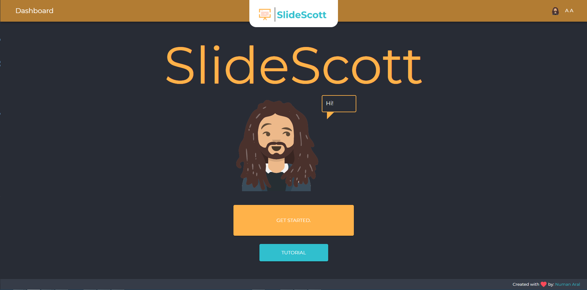
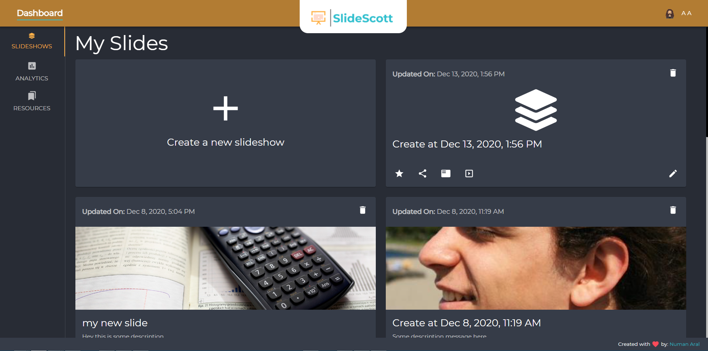
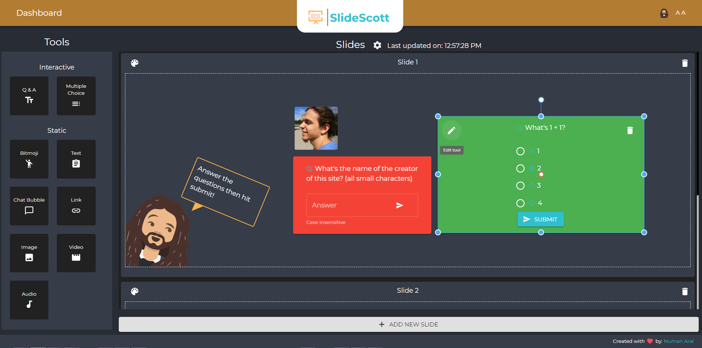
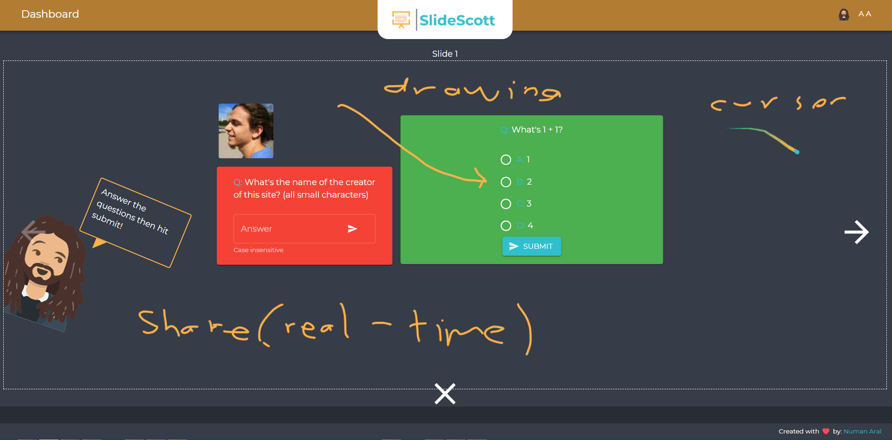
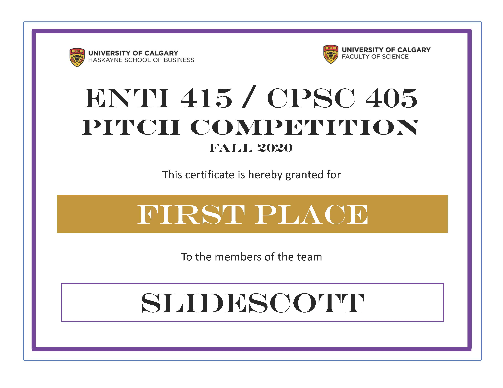

# slide-scott
**Create interactive slides and share with your students!**

## General Screenshots

## First Place (Enti 415 / CPSC 405 Pitch Competition)

## Features:
- **Slide builder**
  - Drag and drop tools into the slide screen
    - 2 types of tools:
      1. Interactive
          - These tools can be directly interacted by the slide viewers
      2. Static
          - These elements cannot be interacted with
    - Customize the tools:
      - Position
      - Size
      - Orientation
      - Rotation
      - Colors
      - Text
      - Other settings...
- **Synchronous Slide Views** (Present & Live)
  - Allows presenter to:
    - Control the pages of the slides
    - Share his current cursor location
    - Draw on the slides
  - Allows viewers to:
    - See the presenter's cursor location
    - See the presenter's drawings on the slides
- **Asnychronous Slide View** (Slides)
  - The viewer can freely use the slides
  - In the end of the slide, they can provide feedback
- **Dashboard**
  - Has 3 tabs:
    1. Slideshows
        - Users can:
          - Create/read/update/delete their slides
          - View and/or share their own slides in one of the 3 modes:
            1. Presenter Mode
                - Collaboration feature (Disabled - not tested enough)
                  - Allow multiple users to work on the slide together
            2. Live View Mode
            3. Nomal View Mode
          - Create a new slide using one of the previous slides as a template (Not implemented)
          - Favorite slides (Not implemented - Allow you to view and favoritie shared/public slides)        
    2. Analytics
    3. Resources
- **Authorization**
  - Users can create an account
  - Carry all their preferences across devices
  - Be given roles
- **Customization**
  - Personal bitmoji
    - Allows you to display your personal bitmoji in the slides
  - Theme colors
    - Dark & Light mode
    - Primary/Secondary app colors

&nbsp;
## Paths
- **Developer paths:**
	- `/dev-settings`: Developer only settings.
- **Private / Logged in paths:**
	- `/dashboard`: Dashboard page for the user. Includes Slideshows, Analytics and Resources.
	- `/create/:id`: Create/edit page for slides
	- `/profile`: Preferences and bitmoji selection screen
	- `/present/:id`: Presenter screen, allows you to display cursor location and write on the slides.
- **Public paths**
	- `/slides/:id`: Asynchronous slide view screen, you can do the slides here.
	- `/live/:id`: Synchronous slide view screen, you see the presenters cursor, his drawings in real time and pages automatically switch based in his current page.
	- `/login`: Login page.
	- `/signup`: Registration page.
- **Redirect / Custom error paths**
	- `/unauthorized` If you go to a page that you don't have access to, you will be redirected here.
	- `/not-found`: If you go to a path that doesn't exist, you will be redirected here.
